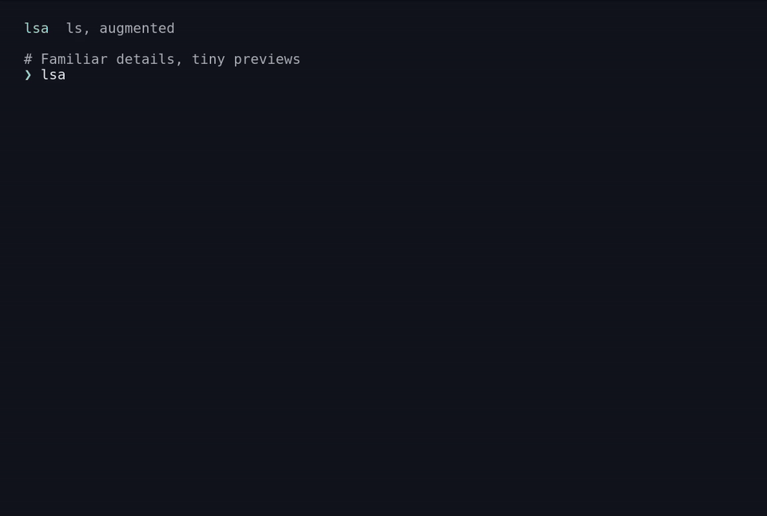

# lsa

**ls, augmented.** See your files, with readable details, colors, icons and
inline image thumbnails. Everything stays in terminal scrollback, and you're
straight back at the shell.

One Rust binary for macOS and Linux. No configuration file or background process.

[](docs/assets/lsa-in-ghostty.mp4?raw=true)

18 seconds in Ghostty 1.3.1 on Linux, using lsa 0.5.0 and generated sample images.
[Download the MP4](docs/assets/lsa-in-ghostty.mp4?raw=true) · [Demo details](docs/demo.md)

## Install

```sh
brew install yungibly/tap/lsa
lsa
```

No Rust toolchain needed. Prefer a standalone binary? Download a checksummed
archive from [GitHub Releases](https://github.com/yungibly/lsa/releases/latest).
Packages cover Apple Silicon/Intel macOS 14+ and ARM64/x86-64 Linux.
[Installation and upgrades →](docs/install.md)

## Everyday use

```sh
lsa                                   # details, or a grid where images dominate
lsa -la --header                      # hidden files, details and column headings
lsa -C                                # compact columns filled downward (-x: across)
lsa -lt                               # newest first
lsa photos                            # automatic previews in Ghostty / Kitty
lsa --grid --thumbnail-size=6 photos   # larger thumbnails
lsa --no-images                       # text only
lsa | head                            # plain names in pipes
```

`photos` can be any directory of images. `lsa --help` lists every option.
To use lsa as `ls`, optionally add `alias ls=lsa` to your shell configuration.

## What you get

- **Readable listings.** Natural sorting (`photo2` before `photo10`), human-readable
  sizes, local timestamps and familiar `ls` flags.
- **Previews beside your files.** Image-heavy folders become a gallery; long
  listings show tiny previews. Images, folders and other files keep one order.
- **Your terminal's colors.** Honors `LS_COLORS` and `NO_COLOR`, with icons and
  OSC 8 clickable names on local terminals.
- **Sensible fallbacks.** Pipes get complete names, one per line. Failed previews
  never hide files; preview work, memory and output have explicit limits.

PNG, JPEG, GIF, WebP, BMP, ICO and a restricted SVG subset preview on both
platforms. macOS also uses ImageIO for HEIC/HEIF, AVIF, TIFF, JPEG XL, PSD and
camera RAW formats. See [formats, options and resource limits](docs/usage.md).

## Terminal support

Automatic graphics target direct **Ghostty and Kitty** sessions. The demo shows
real Ghostty rendering; Kitty rendering is still unverified. Other terminals,
SSH and multiplexers get text by default. `--protocol=kitty` can force graphics,
but those paths need their own testing. [Verified environments →](docs/compatibility.md)

lsa lists one directory level and returns to your shell. Recursive listing
(`-R`) and exact GNU/BSD scripting parity are outside its scope.

## Feedback

Tried it in your terminal? [Open an issue](https://github.com/yungibly/lsa/issues)
with your lsa version, OS, terminal/version and the command you ran. Reports of
what worked are useful too; remove private paths or filenames from screenshots.

## Development

```sh
export CARGO_HOME="$PWD/.cargo-home"
cargo fmt --check
cargo clippy --locked --all-targets -- -D warnings
cargo test --locked --all-targets
cargo build --release --locked --examples --bins
./target/release/examples/fixtures          # once: creates img-test/generated
for check in pty layout cache thumbnails gallery; do python3 tests/check_$check.py; done
python3 -m unittest discover -s tests -p 'test_release.py'
python3 scripts/package.py
```

`tests/check_ghostty_vt.py` optionally checks the text layer in Ghostty's own
terminal core. It uses the [tui-test](https://github.com/microsoft/tui-test)
release binary placed at `target/tools/tui-test/tui-test`. Headless checks model
terminal bytes and cursor movement; images still need a real-terminal look.

Keep Cargo storage and test artifacts inside the repository. More detail:
[changelog](CHANGELOG.md), [roadmap](ROADMAP.md), [decisions](docs/decisions.md),
[compatibility](docs/compatibility.md), [measurements](benchmarks/README.md).
